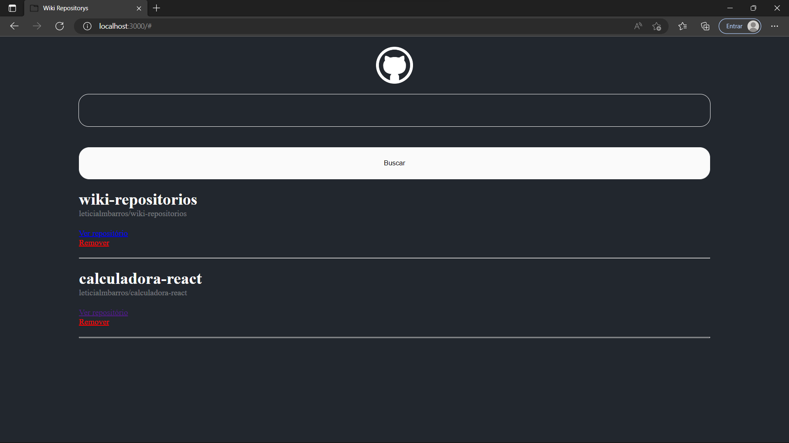

# wiki-repositorios
 > PT-BR

 Projeto irá criar uma Wiki para salvar alguns repositórios do GitHub. Neste projeto foi utilizado React.js, alem de conceitos como useStates, implementamos também um API externo do GitHub, fiz também a estilização dos componentes com o styled.component.

> IN ENGLISH

Project will create a Wiki to save some GitHub repositories. In this project, React.js was used, in addition to concepts such as useStates, we also implemented an external API from GitHub, I also styled the components with styled.component. 
 
 
 